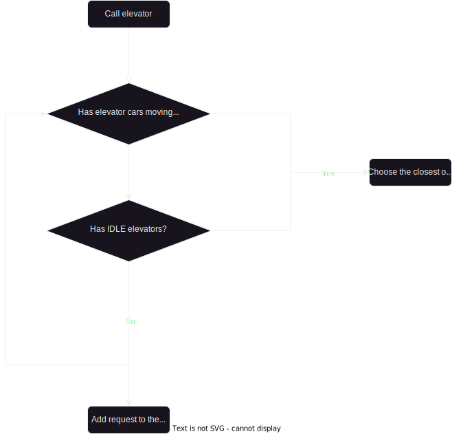

# Elevator System

## Alghoritm
The Elevator System implements the `Destination Dispatch` algorithm, which enables users to specify their desired floor when requesting an elevator. 

This impementation of algorithm `prioritizes optimizing system throughput and energy efficiency` over travel time and waiting time for users.

The metrics for optimizing the elevator system are prioritized in the following order:

* **Throughput:** The system aims to maximize the number of successful elevator trips within a given time frame, efficiently serving as many users as possible.
* **Energy Efficiency:** The algorithm seeks to minimize energy consumption by intelligently managing elevator movement and minimizing unnecessary trips or idling.
* **Travel Time:** The system aims to reduce the time taken for users to travel from their current floor to their desired floor, optimizing the overall efficiency of the elevator operations.
* **Waiting Time:** While prioritizing the above metrics, the system also aims to minimize the waiting time for users by dynamically assigning elevator cars and optimizing their movement.

## Notes

Some features, like `Passenger` class were implemented with future use in mind and are not fully used in current implementation.

## Diagram

